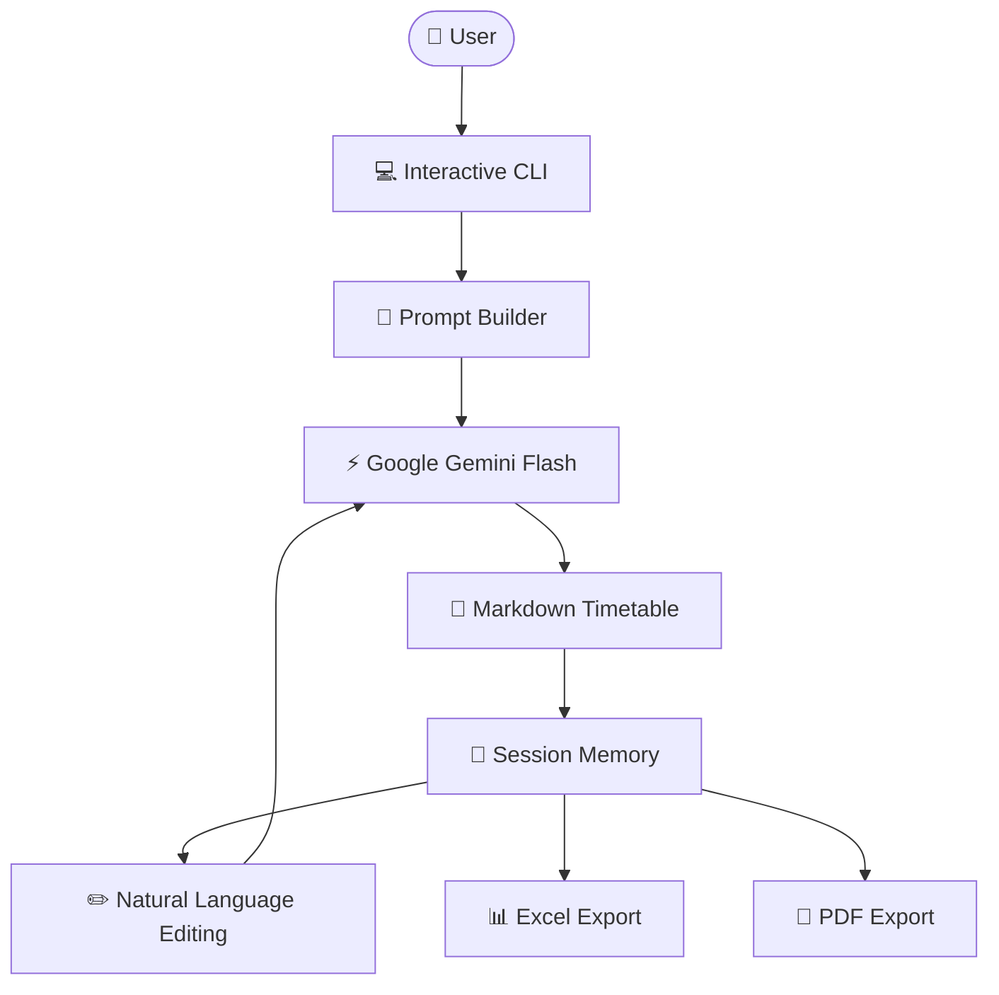
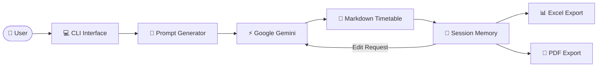
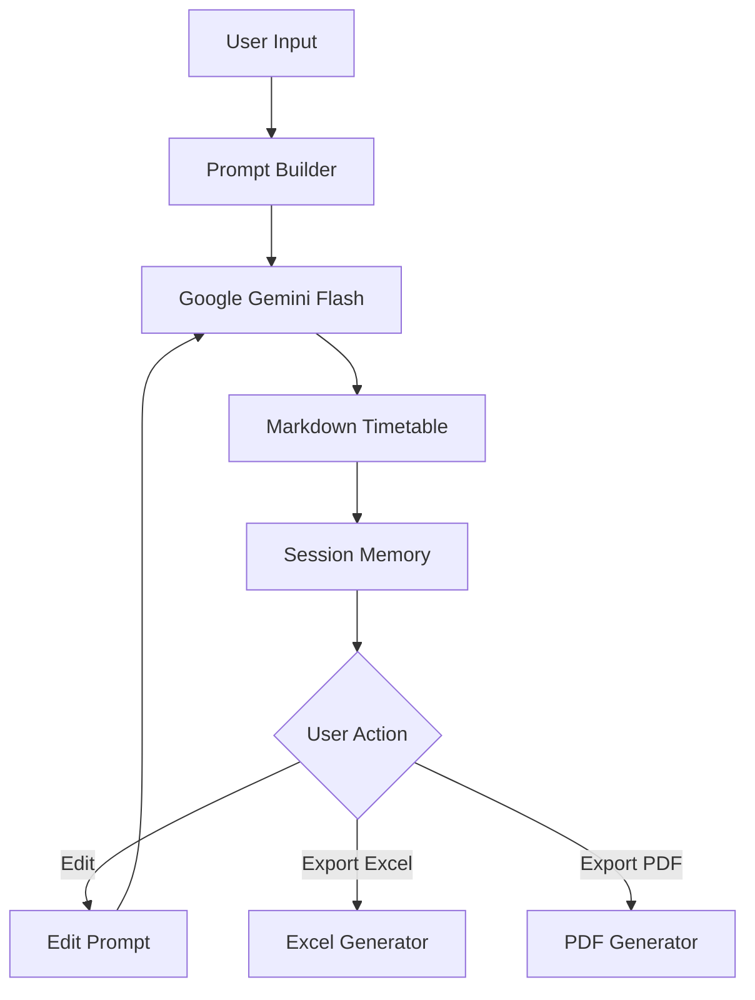

# 🧠 TimeMind — AI-Powered Timetable Generation Agent

> Describe your scheduling requirements in plain English. TimeMind generates a complete, constraint-aware weekly timetable, lets you refine it through natural-language edits, and exports the final schedule to Excel or PDF.

TimeMind is an AI-powered timetable generation assistant built using **Google Gemini**. Instead of manually arranging subjects, professors, classrooms, and time slots, users simply describe their scheduling requirements in natural language. The system generates a structured weekly timetable in Markdown format, remembers the generated schedule during the session, allows conversational edits, and exports the final timetable as professional Excel spreadsheets or printable PDF documents.

Unlike traditional timetable generators that require rigid forms or predefined templates, TimeMind leverages Large Language Models (LLMs) to understand flexible scheduling requirements while respecting user-defined constraints such as professor availability, room allocation, break timings, and subject distribution.

---

## ✨ Features

- 🗓️ **Natural-language timetable generation** — describe your requirements in one prompt and generate a complete weekly timetable.
- 🤖 **LLM-powered scheduling** — uses Google Gemini to understand scheduling constraints and generate structured Markdown tables.
- ✏️ **Conversational timetable editing** — modify an existing timetable using simple natural-language instructions without regenerating everything.
- 🧠 **Session memory** — remembers the previously generated timetable, enabling iterative editing within the same session.
- 📊 **Excel export** — automatically converts Markdown tables into multi-sheet Excel workbooks.
- 📄 **PDF export** — generates clean landscape PDF versions suitable for printing and sharing.
- ⚙️ **Constraint-aware generation** — considers professor assignments, room allocation, subject distribution, and break timings specified by the user.
- 💻 **Lightweight CLI interface** — interactive command-line workflow requiring no graphical interface.

---

# 🏗️ System Architecture



---

# 🤖 Tech Stack

| Component | Technology | Purpose |
|-----------|------------|---------|
| AI Model | Google Gemini Flash | Generates and edits timetables from natural-language prompts |
| Programming Language | Python | Core application logic |
| Data Processing | Pandas | Converts Markdown tables into structured Excel sheets |
| PDF Generation | FPDF | Creates printable timetable PDFs |
| Excel Export | XlsxWriter + OpenPyXL | Writes multi-sheet Excel workbooks |
| Memory | Python Dictionary | Stores generated timetable for conversational editing |
| Interface | Command-Line Interface (CLI) | Interactive user workflow |

---

# 🔗 Component Flow



---

# 🎯 Problem Statement

Creating academic timetables manually is a repetitive and time-consuming task. Coordinators must ensure that:

- professors do not have overlapping classes,
- subjects are distributed fairly throughout the week,
- classroom conflicts are avoided,
- breaks are respected,
- scheduling constraints are satisfied.

Traditional timetable software often requires complex configuration or manual drag-and-drop interfaces.

TimeMind simplifies this process by allowing users to describe scheduling requirements in plain English while the AI handles timetable generation automatically.

---

# 🚀 Key Capabilities

### Natural Language Scheduling

Instead of filling long forms, users simply describe:

- Subjects
- Professors
- Rooms
- Working days
- Time slots
- Break timings
- Scheduling constraints

Example:

```
Generate a timetable for CSE.

Subjects:
DSA, DBMS, OS, CN

Professors:
Alice, Bob, Carol

Rooms:
R1, R2

Break:
12–1 PM

Ensure no professor teaches two classes simultaneously.
```

TimeMind converts this description into a complete weekly timetable.

---

### Conversational Editing

Once a timetable is generated, users don't need to regenerate everything.

They can simply type:

```
Move DBMS from Monday morning to Tuesday afternoon.

Replace Alice with Bob for Operating Systems.

Schedule AI before Machine Learning.

Move PE to the last slot.
```

The AI updates only the required portions while preserving the existing timetable.

---

### Multiple Export Formats

Generated schedules can immediately be exported as:

- Excel (.xlsx)
- PDF (.pdf)

making them suitable for administrators, faculty members, or students.

---

# ⚙️ How It Works

TimeMind follows a simple conversational workflow powered by Google Gemini. The application generates a timetable from a natural-language prompt, stores it in memory, allows iterative edits, and optionally exports the final version to Excel or PDF.

---

## 🧠 Generation Workflow

### Step 1 — User Input

The user describes the timetable requirements in natural language.

The prompt may include:

- Subjects
- Professors
- Departments
- Working days
- Time slots
- Break timings
- Classroom information
- Scheduling constraints

Example:

```
Generate a timetable for CSE.

Subjects: DSA, DBMS, OS, CN
Professors: Alice, Bob, Carol
Rooms: R1, R2
Days: Monday to Friday
Break: 12 PM–1 PM

Constraints:
- No professor teaches two classes simultaneously.
- Every subject appears at least three times per week.
```

---

### Step 2 — Prompt Construction

TimeMind wraps the user's request inside a structured instruction prompt before sending it to Gemini.

The model is instructed to:

- generate a weekly timetable,
- respect professor-subject associations,
- avoid room conflicts,
- preserve break timings,
- return **only Markdown tables**.

Keeping the output in Markdown makes it easy to display, edit, and export.

---

### Step 3 — AI Timetable Generation

Google Gemini processes the scheduling request and generates a complete weekly timetable.

The output consists of structured Markdown tables, typically organized day-wise.

Example:

| Time | Room 1 | Room 2 |
|------|--------|--------|
| 9–10 | DSA | DBMS |
| 10–11 | OS | CN |

---

### Step 4 — Session Memory

After generation, the timetable is stored inside an in-memory session dictionary.

```python
memory = {
    "last_generated": timetable,
    "timetable_details": user_prompt
}
```

This allows TimeMind to remember the current timetable during the session without requiring regeneration.

---

## ✏️ Timetable Editing Workflow

Instead of generating a completely new timetable, users can modify the existing schedule using natural-language instructions.

Example edit requests:

```
Move AI to Tuesday.

Replace Bob with Alice.

Shift DBMS after lunch.

Move PE to the final slot.
```

TimeMind sends:

- the previously generated timetable,
- the user's edit request,

back to Gemini.

The model updates only the relevant portions while preserving the remaining schedule.

The updated timetable replaces the previous version in session memory.

---

## 🧠 Memory Architecture

TimeMind maintains lightweight conversational memory throughout a single execution.

The memory stores:

| Key | Purpose |
|------|----------|
| `last_generated` | Stores the latest generated Markdown timetable |
| `timetable_details` | Stores the original scheduling request |

Because edits always reference the stored timetable, users can iteratively refine schedules without repeating the entire prompt.

---

# 📊 Export Pipeline

Generated timetables remain in Markdown until the user requests an export.

TimeMind supports two export formats.

---

## Markdown → Excel

The Markdown timetable is converted into a structured Excel workbook.

The converter:

- detects each day heading,
- parses Markdown tables,
- converts rows into Pandas DataFrames,
- creates separate Excel worksheets for every day,
- writes the workbook using XlsxWriter.

Result:

```
timetable.xlsx

├── Monday
├── Tuesday
├── Wednesday
├── Thursday
└── Friday
```

Each worksheet contains an individual timetable for that day.

---

## Markdown → PDF

The same Markdown tables can also be exported as printable PDFs.

The PDF generator:

- creates landscape A4 pages,
- renders day headings,
- formats timetable cells,
- truncates overly long text,
- produces printer-friendly schedules.

Output:

```
timetable.pdf
```

This format is suitable for distribution among students and faculty.

---

# 🔄 Overall Workflow



---

# 🚀 Getting Started

## Prerequisites

- Python 3.10+
- Google Gemini API Key

---

## Installation

```bash
git clone https://github.com/vaibhavsimha-j/TimeMind.git

cd TimeMind

pip install -r requirements.txt
```

---

## Configure API Key

Set your Gemini API key as an environment variable.

### Windows

```bash
set GEMINI_API_KEY=YOUR_API_KEY
```

### macOS / Linux

```bash
export GEMINI_API_KEY=YOUR_API_KEY
```

---

## Run the Application

```bash
python main.py
```

---

# 💬 Usage Examples

## Generate a Timetable

```
Generate a timetable for CSE.

Subjects:
DSA
DBMS
OS
CN

Professors:
Alice
Bob
Carol

Rooms:
R1
R2

Days:
Monday to Friday

Break:
12 PM–1 PM
```

---

## Edit the Timetable

```
Move DBMS to Tuesday morning.

Replace Alice with Krishna.

Schedule AI before Machine Learning.

Move PE to the final slot.
```

---

## Export

After generation or editing, TimeMind asks:

```
Download timetable?

excel
pdf
both
no
```

The selected files are generated automatically.

---

# 📁 Repository Structure

```
TimeMind/

├── main.py
├── requirements.txt
├── sampleprompts.txt
└── README.md
```

### File Overview

| File | Description |
|------|-------------|
| `main.py` | Main application containing timetable generation, editing, export utilities, and CLI workflow |
| `requirements.txt` | Project dependencies |
| `sampleprompts.txt` | Example scheduling prompts demonstrating supported constraints |
| `README.md` | Project documentation |

---

# 🌟 Key Design Decisions

### Natural Language Instead of Complex Forms

Most timetable generators require users to manually fill large forms specifying every subject, professor, classroom, and scheduling rule.

TimeMind adopts a conversational approach where users simply describe their requirements in plain English. The Large Language Model interprets the request and generates a structured timetable automatically, making the system significantly more intuitive and flexible.

---

### Markdown as the Intermediate Format

Rather than generating Excel or PDF files directly, TimeMind first produces the timetable as a Markdown table.

Markdown serves as a lightweight intermediate representation that is:

- Human-readable
- Easy to edit
- Easy to export
- Platform-independent

This design allows the same timetable to be reused for multiple output formats without regenerating it.

---

### Session-Based Memory

Instead of asking users to regenerate an entire timetable after every modification, TimeMind stores the most recently generated schedule in memory.

Each edit request references this stored timetable, enabling conversational refinement while keeping the workflow lightweight.

Although the memory exists only during the current session, it provides a smooth iterative editing experience.

---

### LLM-Centric Scheduling

Traditional timetable systems rely on handcrafted scheduling algorithms and constraint solvers.

TimeMind delegates timetable generation to Google Gemini, allowing users to express scheduling requirements naturally without learning rigid input formats.

This significantly reduces implementation complexity while providing flexible timetable generation.

---

### Separate Export Pipeline

Timetable generation and document generation are intentionally separated.

The AI focuses solely on producing structured Markdown, while dedicated export modules convert the result into Excel or PDF.

This separation keeps responsibilities independent and makes future export formats easy to add.

---

# 📦 Dependencies

```text
google-genai
pandas
fpdf
openpyxl
xlsxwriter
```

| Library | Purpose |
|----------|---------|
| `google-genai` | Communicates with Google Gemini for timetable generation and editing |
| `pandas` | Processes Markdown tables and converts them into DataFrames |
| `fpdf` | Generates printable PDF timetables |
| `xlsxwriter` | Writes formatted Excel workbooks |
| `openpyxl` | Supports Excel file creation and compatibility |

---

# ⚠️ Limitations

- The quality of generated timetables depends on the clarity of the user's prompt.
- TimeMind relies on the reasoning capabilities of Google Gemini and does not perform deterministic constraint validation.
- Session memory is temporary and is cleared when the application exits.
- Internet connectivity is required for AI-powered timetable generation.
- Generated PDF formatting is optimized for standard weekly schedules and may truncate exceptionally long cell contents.
- The current version operates as a command-line application and does not include a graphical web interface.

---

# 🔮 Future Improvements

Several enhancements can further improve TimeMind:

- 🌐 Streamlit or React-based web interface
- 📅 Calendar integration with Google Calendar and Outlook
- 📂 Import existing Excel timetables for editing
- 🧩 Department-wise timetable generation
- 🏫 Multi-semester scheduling support
- 🔐 User authentication and timetable history
- 📊 Automatic timetable conflict detection and validation
- ⚡ Multi-model AI support (Gemini, GPT, Claude, Groq)
- ☁️ Cloud deployment with persistent storage
- 📱 Mobile-friendly interface

---

# 🔑 API Key

TimeMind uses the **Google Gemini API** for timetable generation and editing.

Create a free API key from:

https://aistudio.google.com/

Set the environment variable before running the application.

**Windows**

```bash
set GEMINI_API_KEY=YOUR_API_KEY
```

**macOS / Linux**

```bash
export GEMINI_API_KEY=YOUR_API_KEY
```

---

# 📚 Sample Prompts

The repository includes a `sampleprompts.txt` file containing example scheduling requests.

These examples demonstrate:

- Department timetable generation
- Multi-department scheduling
- Laboratory allocation
- Professor assignment constraints
- Classroom management
- Custom break timings
- Advanced scheduling rules

Users can modify these prompts or create entirely new ones depending on their scheduling requirements.

---

# 💡 Possible Use Cases

TimeMind can assist in creating schedules for:

- Universities
- Engineering colleges
- Schools
- Coaching institutes
- Training centers
- Workshops
- Bootcamps
- Corporate learning programs

---

# 👨‍💻 Author

**Vaibhav Simha J**

AI Engineer • Machine Learning Enthusiast • Full-Stack AI Developer

📧 **vaibhavsimhajworks@gmail.com**

🔗 **LinkedIn:**  
https://www.linkedin.com/in/vaibhav-simha-j-0b46b5327/

🔗 **GitHub:**  
https://github.com/vaibhavsimha-j

---

# 📄 License

This project was developed by **Vaibhav Simha J** for educational and portfolio purposes.

Feel free to explore, learn from, and build upon this work with appropriate attribution.

---

# ⭐ Support

If you found this project useful, consider giving the repository a ⭐ on GitHub.

It helps others discover the project and motivates future improvements.

---

> **TimeMind**
>
> *Think less about scheduling.*
>
> *Describe your timetable.*
>
> *Let AI organize your time.*