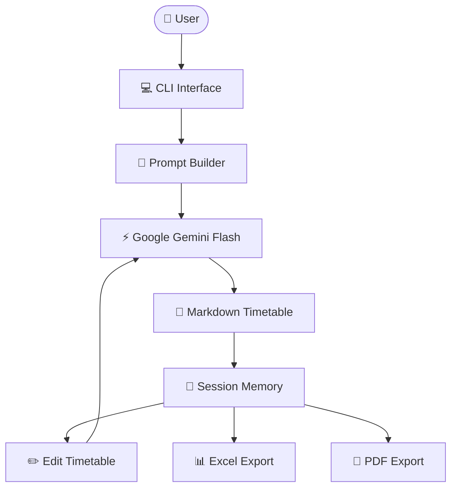

# 🧠 TimeMind — AI Timetable Generator

> Generate complete weekly timetables from natural-language prompts, edit them conversationally, and export the final schedule to Excel or PDF.

TimeMind is an AI-powered timetable generator built with **Google Gemini**. Instead of manually arranging subjects, professors, classrooms, and time slots, users simply describe their scheduling requirements in plain English. TimeMind generates a structured weekly timetable, remembers it during the session for iterative edits, and exports the final schedule as Excel or PDF.

---

## ✨ Features

- 🗓️ Generate weekly timetables from natural-language prompts.
- ✏️ Edit existing timetables using conversational instructions.
- 🧠 Session memory for iterative modifications.
- 📊 Export schedules to Excel and PDF.
- ⚡ Powered by Google Gemini Flash.
- 💻 Lightweight command-line interface.

---

## 🏗️ Architecture



---

## 🤖 Tech Stack

| Component | Technology |
|-----------|------------|
| AI Model | Google Gemini Flash |
| Language | Python |
| Data Processing | Pandas |
| PDF Generation | FPDF |
| Excel Export | XlsxWriter |

---

## ⚙️ How It Works

1. Describe your timetable requirements in natural language.
2. Google Gemini generates a weekly timetable in Markdown format.
3. The timetable is stored in session memory.
4. Modify the timetable using conversational edit requests.
5. Export the final timetable as Excel or PDF.

---

## 🚀 Getting Started

### Prerequisites

- Python 3.10+
- Google Gemini API Key

### Installation

```bash
git clone https://github.com/vaibhavsimha-j/TimeMind.git

cd TimeMind

pip install -r requirements.txt
```

### Configure API Key

**Windows**

```bash
set GEMINI_API_KEY=YOUR_API_KEY
```

**macOS / Linux**

```bash
export GEMINI_API_KEY=YOUR_API_KEY
```

### Run

```bash
python main.py
```

---

## 💬 Example Prompt

```text
Generate a timetable for the CSE department.

Subjects: DSA, DBMS, OS, CN
Professors: Alice, Bob, Carol
Rooms: R1, R2
Days: Monday to Friday
Break: 12:00–1:00 PM

Ensure no professor teaches two classes simultaneously and every subject appears at least three times per week.
```

---

## 📁 Repository Structure

```
TimeMind/
├── main.py
├── requirements.txt
├── sampleprompts.txt
└── README.md
```

---

## ⚠️ Limitations

- Timetable quality depends on the clarity of the input prompt.
- Session memory is cleared when the application exits.
- Internet connectivity is required to access Google Gemini.
- The current version is a command-line application.

---

## 👨‍💻 Author

**Vaibhav Simha J**

📧 **vaibhavsimhajworks@gmail.com**

- GitHub: https://github.com/vaibhavsimha-j
- LinkedIn: https://www.linkedin.com/in/vaibhav-simha-j-0b46b5327/

---

## 📄 License

This project is open for learning and educational purposes. Feel free to explore, modify, and build upon it with appropriate attribution.

---

> **TimeMind**
>
> *Describe your timetable. Let AI organize your time.*